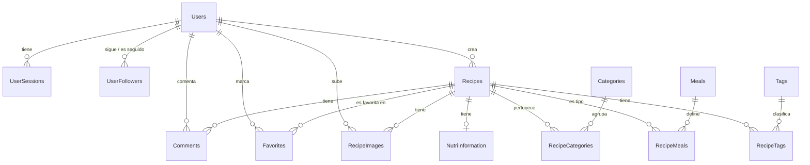

# Estructura del Modelo de Datos - RecetApp

Este documento describe de manera detallada las tablas implicadas, sus relaciones, secuencias y procedimientos almacenados utilizados en la aplicación **RecetApp**, deducidos a partir de la configuración JPA del proyecto.

---

## 1. Diagrama del Modelo Entidad-Relación (Conceptual)

---

## 2. Catálogo de Tablas

### 2.1 Tabla: `Users`
Almacena la información de los usuarios registrados en el sistema.

| Columna | Tipo SQL Server | Nulabilidad | Claves / Restricciones | Descripción |
| :--- | :--- | :--- | :--- | :--- |
| `userId` | `INT` | `NOT NULL` | **PK (IDENTITY)** | Identificador único autoincremental del usuario. |
| `username` | `VARCHAR(50)` | `NOT NULL` | **UNIQUE** | Nombre de usuario único para autenticación. |
| `password` | `VARCHAR(255)` | `NOT NULL` | - | Hash BCrypt de la contraseña del usuario. |
| `email` | `VARCHAR(100)` | `NOT NULL` | **UNIQUE** | Dirección de correo electrónico asociada y única. |
| `createdAt` | `DATETIME` | `NOT NULL` | Default: `GETDATE()` | Fecha y hora de creación de la cuenta. |
| `lastLogin` | `DATETIME` | `NULL` | - | Fecha y hora del último inicio de sesión exitoso. |
| `online` | `BIT` | `NOT NULL` | Default: `0` (false) | Estado en línea (`1` para online, `0` para offline). |
| `AppVersion` | `VARCHAR(50)` | `NULL` | - | Versión de la app con la que se logueó por última vez. |
| `code` | `VARCHAR(10)` | `NULL` | - | Código temporal de 4 dígitos para activación/recuperación. |
| `validateUser` | `BIT` | `NOT NULL` | Default: `0` (false) | Indica si la cuenta del usuario está verificada/validada. |
| `new` | `INT` | `NULL` | - | Bit o entero indicando si es un usuario recién creado. |

---

### 2.2 Tabla: `UserSessions`
Registra las sesiones activas persistidas. Hay un límite de máximo 2 sesiones por usuario.

| Columna | Tipo SQL Server | Nulabilidad | Claves / Restricciones | Descripción |
| :--- | :--- | :--- | :--- | :--- |
| `sessionId` | `INT` | `NOT NULL` | **PK (IDENTITY)** | Identificador único de sesión. |
| `userId` | `INT` | `NOT NULL` | **FK** -> `Users(userId)` | ID del usuario de la sesión. |
| `username` | `VARCHAR(50)` | `NOT NULL` | - | Username del usuario en sesión. |
| `sessionToken`| `VARCHAR(255)`| `NOT NULL` | **UNIQUE** | Token UUID concatenado con timestamp. |
| `ipAddress` | `VARCHAR(45)` | `NOT NULL` | - | Dirección IP de la solicitud de la sesión. |
| `userAgent` | `VARCHAR(500)`| `NOT NULL` | - | User-Agent de la cabecera del dispositivo. |
| `loginTime` | `DATETIME` | `NOT NULL` | - | Fecha de inicio de la sesión. |
| `lastActivity`| `DATETIME` | `NOT NULL` | - | Última fecha en que se detectó actividad del token. |
| `isActive` | `BIT` | `NOT NULL` | Default: `1` (true) | Determina si la sesión está vigente. |

---

### 2.3 Tabla: `UserFollowers`
Mapea la relación de seguimiento de usuarios (seguidores/seguidos).

| Columna | Tipo SQL Server | Nulabilidad | Claves / Restricciones | Descripción |
| :--- | :--- | :--- | :--- | :--- |
| `id` | `BIGINT` | `NOT NULL` | **PK** (`UserFollowersIdSequence`) | ID incremental basado en secuencia. |
| `follower_id` | `INT` | `NOT NULL` | **FK** -> `Users(userId)` (CASCADE) | ID del usuario seguidor. |
| `followed_id` | `INT` | `NOT NULL` | **FK** -> `Users(userId)` (NO ACTION)| ID del usuario seguido. |
| `createdAt` | `DATETIME` | `NOT NULL` | Default: `GETDATE()` | Fecha de la acción de seguimiento. |

> [!NOTE]
> Esta tabla tiene un **Constraint Único (UC_UserFollowers)** sobre la combinación de `(follower_id, followed_id)`.

---

### 2.4 Tabla: `Recipes`
Almacena los datos principales de las recetas de cocina.

| Columna | Tipo SQL Server | Nulabilidad | Claves / Restricciones | Descripción |
| :--- | :--- | :--- | :--- | :--- |
| `recipeId` | `INT` | `NOT NULL` | **PK (IDENTITY)** | Identificador único de la receta. |
| `userId` | `INT` | `NOT NULL` | **FK** -> `Users(userId)` | Creador de la receta. |
| `title` | `VARCHAR(100)` | `NOT NULL` | - | Título de la receta. |
| `description` | `NVARCHAR(MAX)`| `NULL` | - | Descripción o introducción de la receta. |
| `createdAt` | `DATETIME` | `NOT NULL` | Default: `GETDATE()` | Fecha en que fue publicada. |
| `preparationTime`| `VARCHAR(50)`| `NULL` | - | Tiempo de preparación estimado (ej: "15 minutos"). |
| `servings` | `INT` | `NULL` | - | Porciones / raciones. |
| `ingredientsCount`| `INT` | `NULL` | - | Número de ingredientes requeridos. |
| `proced` | `NVARCHAR(MAX)`| `NULL` | - | Pasos o procedimiento de la receta detallado. |

---

### 2.5 Tabla: `Categories`
Catálogo de etiquetas generales del tipo de receta (desayuno, cena, vegetariano, etc.).

| Columna | Tipo SQL Server | Nulabilidad | Claves / Restricciones | Descripción |
| :--- | :--- | :--- | :--- | :--- |
| `categoryId` | `INT` | `NOT NULL` | **PK (IDENTITY)** | Identificador de la categoría. |
| `name` | `VARCHAR(100)` | `NOT NULL` | **UNIQUE** | Nombre descriptivo de la categoría. |

---

### 2.6 Tabla: `Meals`
Tipos de comidas específicas (Desayuno, Almuerzo, Cena, Merienda, Snack).

| Columna | Tipo SQL Server | Nulabilidad | Claves / Restricciones | Descripción |
| :--- | :--- | :--- | :--- | :--- |
| `mealId` | `INT` | `NOT NULL` | **PK (IDENTITY)** | Identificador de tipo de comida. |
| `name` | `VARCHAR(100)` | `NOT NULL` | **UNIQUE** | Nombre del tipo de comida. |

---

### 2.7 Tabla: `Tags`
Mapea etiquetas adicionales para clasificar recetas en el frontend.

| Columna | Tipo SQL Server | Nulabilidad | Claves / Restricciones | Descripción |
| :--- | :--- | :--- | :--- | :--- |
| `tagId` | `INT` | `NOT NULL` | **PK (IDENTITY)** | Identificador del tag. |
| `name` | `VARCHAR(100)` | `NOT NULL` | **UNIQUE** | Nombre de la etiqueta. |

---

### 2.8 Tablas Intermedias de Relación de Recetas
Utilizadas para mapear relaciones Many-to-Many entre Recetas y atributos asociados:

#### Tabla: `RecipeCategories`
Vincula recetas con sus respectivas categorías.
* `recipeCategoryId` (`INT` Core ID (PK, IDENTITY))
* `recipeId` (`INT`, FK -> `Recipes(recipeId)`)
* `categoryId` (`INT`, FK -> `Categories(categoryId)`)

#### Tabla: `RecipeMeals`
Vincula recetas con sus tipos de comidas (meals).
* `recipeMealId` (`INT` Core ID (PK, IDENTITY))
* `recipeId` (`INT`, FK -> `Recipes(recipeId)`)
* `mealId` (`INT`, FK -> `Meals(mealId)`)

#### Tabla: `RecipeTags`
Vincula recetas con tags asignados.
* `recipeTagId` (`INT` Core ID (PK, IDENTITY))
* `recipeId` (`INT`, FK -> `Recipes(recipeId)`)
* `tagId` (`INT`, FK -> `Tags(tagId)`)

---

### 2.9 Tabla: `RecipeImages`
Almacena la ruta/URL de las imágenes de las recetas subidas por los usuarios.

| Columna | Tipo SQL Server | Nulabilidad | Claves / Restricciones | Descripción |
| :--- | :--- | :--- | :--- | :--- |
| `imageId` | `INT` | `NOT NULL` | **PK (IDENTITY)** | Identificador de la imagen. |
| `recipeId` | `INT` | `NOT NULL` | **FK** -> `Recipes(recipeId)` | Receta relacionada. |
| `userId` | `INT` | `NOT NULL` | **FK** -> `Users(userId)` | Usuario que sube la imagen. |
| `imageUrl` | `VARCHAR(255)` | `NOT NULL` | - | Ruta / URL de la imagen en el almacenamiento. |
| `uploadedAt` | `DATETIME` | `NOT NULL` | Default: `GETDATE()` | Fecha y hora en la que se subió. |

---

### 2.10 Tabla: `NutriInformation`
Contiene los valores nutricionales asociados a una receta (Relación Uno a Uno).

| Columna | Tipo SQL Server | Nulabilidad | Claves / Restricciones | Descripción |
| :--- | :--- | :--- | :--- | :--- |
| `nutriId` | `INT` | `NOT NULL` | **PK (IDENTITY)** | Identificador de información nutricional. |
| `recipeId` | `INT` | `NOT NULL` | **FK -> Recipes(recipeId)** (UNIQUE) | ID de la receta relacionada (1:1). |
| `calories` | `VARCHAR(50)` | `NULL` | - | Calorías (ej: "250 kcal"). |
| `fat` | `VARCHAR(50)` | `NULL` | - | Grasas totales (ej: "8g"). |
| `saturatedFat` | `VARCHAR(50)` | `NULL` | - | Grasas saturadas. |
| `polyunsaturatedFat`| `VARCHAR(50)`| `NULL` | - | Grasas poliinsaturadas. |
| `monounsaturatedFat`| `VARCHAR(50)`| `NULL` | - | Grasas monoinsaturadas. |
| `carbohydrates` | `VARCHAR(50)` | `NULL` | - | Carbohidratos totales. |
| `sugar` | `VARCHAR(50)` | `NULL` | - | Azúcares. |
| `fiber` | `VARCHAR(50)` | `NULL` | - | Fibra dietética. |
| `protein` | `VARCHAR(50)` | `NULL` | - | Proteína. |
| `sodium` | `VARCHAR(50)` | `NULL` | - | Sodio. |

---

### 2.11 Tabla: `Comments`
Facilita la interacción enviando comentarios a las recetas.

| Columna | Tipo SQL Server | Nulabilidad | Claves / Restricciones | Descripción |
| :--- | :--- | :--- | :--- | :--- |
| `commentId` | `INT` | `NOT NULL` | **PK (IDENTITY)** | ID del comentario. |
| `recipeId` | `INT` | `NOT NULL` | **FK** -> `Recipes(recipeId)` | Receta comentada. |
| `userId` | `INT` | `NOT NULL` | **FK** -> `Users(userId)` | Autor del comentario. |
| `content` | `NVARCHAR(MAX)`| `NOT NULL` | - | Contenido del comentario. |
| `createdAt` | `DATETIME` | `NOT NULL` | Default: `GETDATE()` | Fecha del comentario. |

---

### 2.12 Tabla: `Favorites`
Indica si a un usuario le gusta una receta específica.

| Columna | Tipo SQL Server | Nulabilidad | Claves / Restricciones | Descripción |
| :--- | :--- | :--- | :--- | :--- |
| `favoriteId` | `INT` | `NOT NULL` | **PK (IDENTITY)** | ID del favorito. |
| `recipeId` | `INT` | `NOT NULL` | **FK** -> `Recipes(recipeId)` | Receta de favorito. |
| `userId` | `INT` | `NOT NULL` | **FK** -> `Users(userId)` | Usuario que marcó la receta. |
| `createdAt` | `DATETIME` | `NOT NULL` | Default: `GETDATE()` | Fecha de adición a favoritos. |

> [!NOTE]
> Esta tabla posee un **Constraint Único (UC_Favorites)** sobre la combinación de `(recipeId, userId)`.

---

## 3. Secuencias de Base de Datos

### 3.1 `UserFollowersIdSequence`
* **Tipo:** Secuencia SQL
* **Uso:** Utilizada para autoincrementar la clave primaria `id` de la tabla `UserFollowers` en lugar de la estrategia por defecto Identity de Hibernate para evitar bloqueos/conflictos de inserción concurrente.

---

## 4. Procedimientos Almacenados (Stored Procedures)

La aplicación utiliza `JdbcTemplate` para ejecutar lógica en base de datos mediante los siguientes Stored Procedures:

### 4.1 Proceso: `sp_LogoutUser`
Cierra las sesiones y actualiza campos correspondientes al cierre de sesión.
* **Firma:** `EXEC sp_LogoutUser ?, ?, ?, ?`
* **Parámetros:**
  1. `@Username` (`NVARCHAR` / `VARCHAR` - INPUT): Nombre del usuario que sale del sistema.
  2. `@ResultCode` (`INT` - OUTPUT): Retorna `0` en caso de éxito, otro número si hay error.
  3. `@ResultMessage` (`NVARCHAR` - OUTPUT): Mensaje textual del estatus (ej: "Logout exitoso").
  4. `@SessionsTerminated` (`INT` - OUTPUT): Cantidad de sesiones expiradas en el proceso.

### 4.2 Proceso: `ValidateNewUser`
Verifica si el usuario es nuevo y actualiza el estado correspondiente en base de datos.
* **Firma:** `EXEC ValidateNewUser ?`
* **Parámetros:**
  1. `@UserId` (`INT` - INPUT): Identificador para validar al usuario.
* **Retorno:** Devuelve un mapa conteniendo la información de estado interno posterior a la validación.

### 4.3 Proceso: `sp_FollowUser`
Permite asociar una relación de seguidores llamando lógica del SP.
* **Firma:** `EXEC sp_FollowUser ?, ?`
* **Parámetros:**
  1. `@FollowerId` (`INT` - INPUT): ID de quien sigue.
  2. `@FollowedId` (`INT` - INPUT): ID del usuario que será seguido.
* **Retorno:** Un ResultSet con las columnas `Resultado` o `Mensaje` indicando si la operación procedió con éxito.
